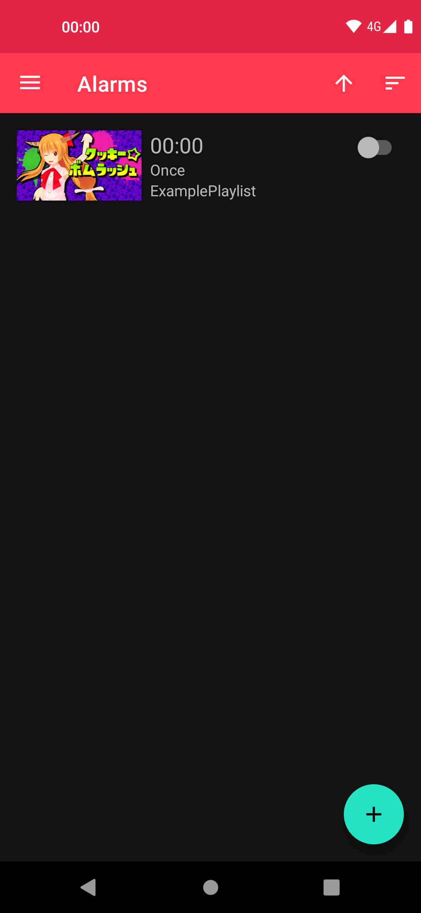
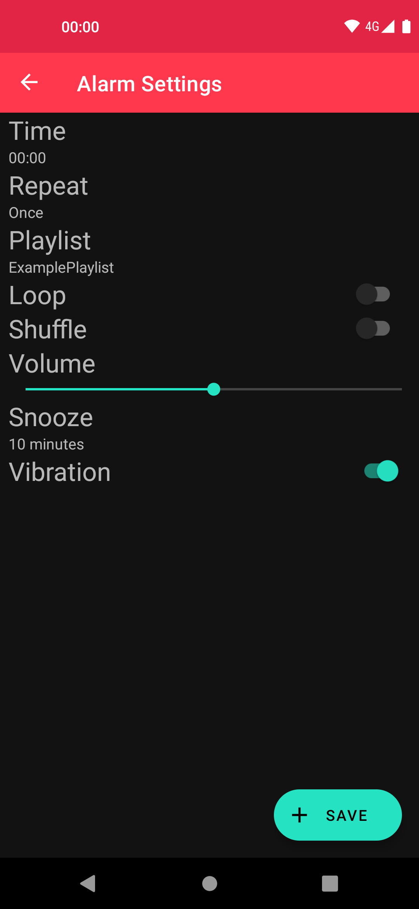
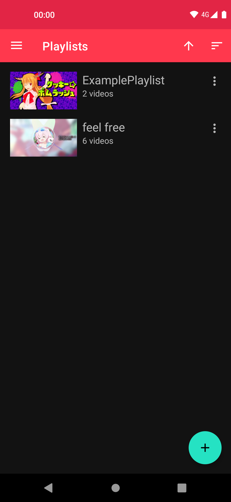
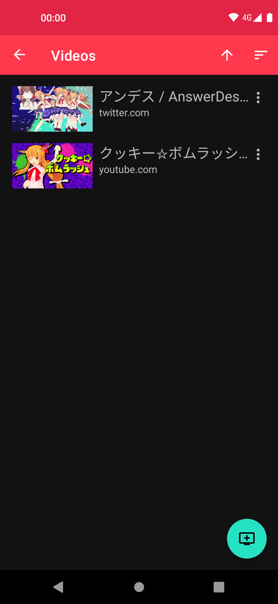
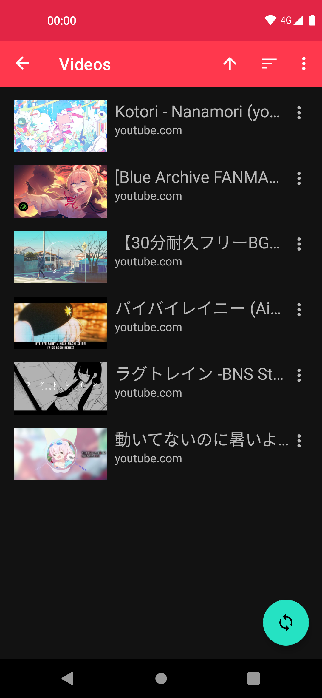
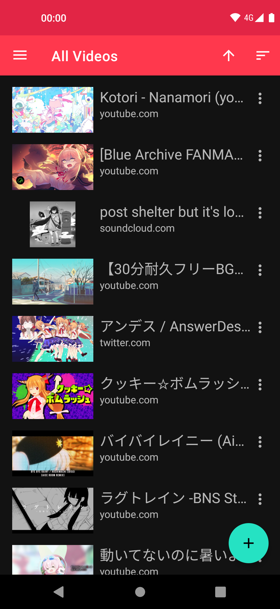
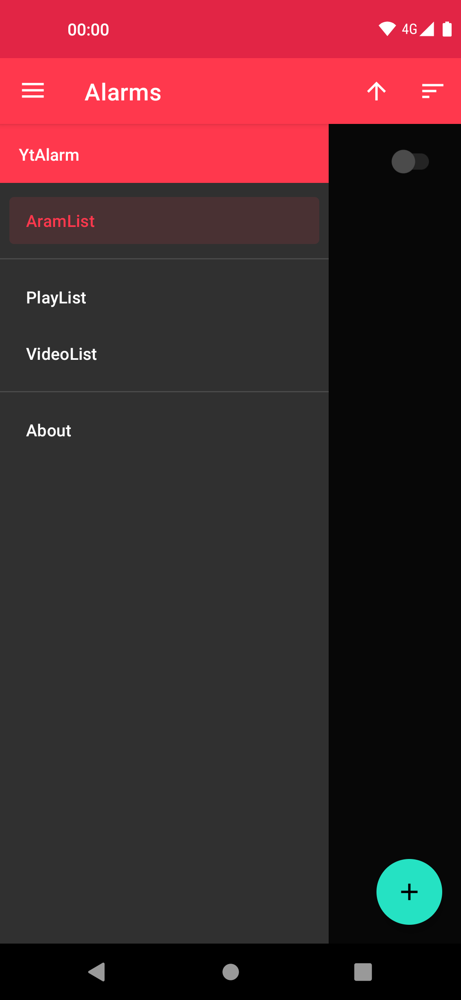
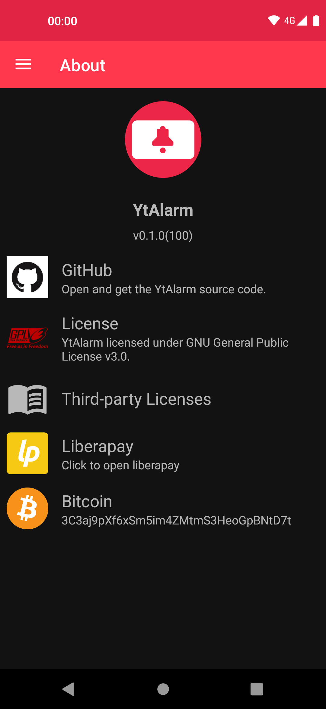

<h4 align="center"><b>A simple alarm app using youtubedl-android</b></h4>

<a href="https://github.com/turtton/YtAlarm/actions/workflows/check_code.yml">
    

------

Other languages: [日本語](docs/readme/README_ja.md)

**Attention: Do not put this application or any fork of it into google play store. It violates their teams and conditions.**

YtAlarm is a simple alarm application using [youtubedl-android](https://github.com/yausername/youtubedl-android). It makes be possible to wake up with a video/music which you like.  
This application does not use Google's developer services or service-dpendent APIs such as YoutubeAPI, so it will work without problems on any Android device that meets the supported Api level(probably).  
Also, you do not need an account for each service to use this application.

# Screenshots

# Feature

### Alarm

- Repeat(Every day, Day of week, Date)
- Loop
- Volume Setting
- Snooze

### Media player

- streaming
- ~~download~~(In progress [#140](https://github.com/turtton/YtAlarm/issues/140))

### Media Management

- Playlist Import

# Supported Services

Internally, the services mentioned [here](https://github.com/yt-dlp/yt-dlp/tree/master/yt_dlp/extractor) will work since this application uses [yt-dlp](https://github.com/yt-dlp/yt-dlp), but some services only support  download mode.

[Available services](docs/AVAILABLE_SERVICES.md)

# Contribution

Whether bug reporting, feature requests, translations, code changes, help is always welcome!!

See [Contributing](.github/CONTRIBUTING.md) for more information.

# Donate

If you like YtAlarm, you're welcome to send a donation.

<table>
    <tr>
        <td></td>
        <td>

</td>
        <td></td>
    </tr>
    <tr>
        <td>

</td>
        <td>

</td>
        <td>3C3aj9pXf6xSm5im4ZMtmS3HeoGpBNtD7t  </td>
    </tr>
</table>

# License

YtAlarm licensed under [GNU General Public License v3.0](https://github.com/turtton/YtAlarm/blob/HEAD/LICENSE)

Other libraries/tools licenses used by this project can be seen below.

