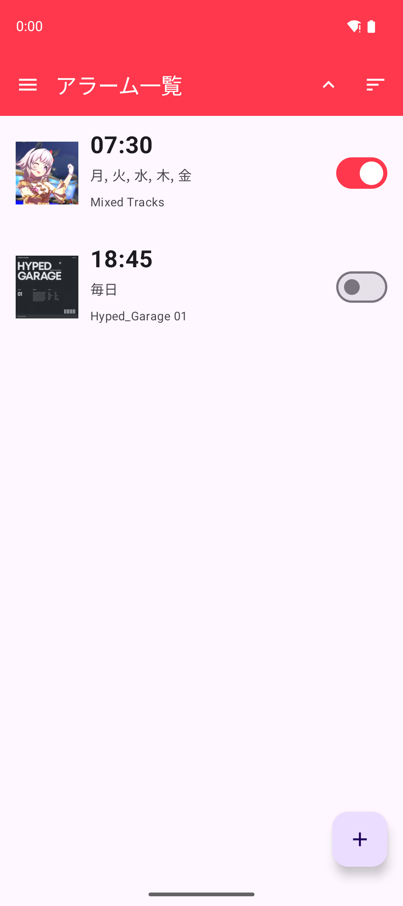
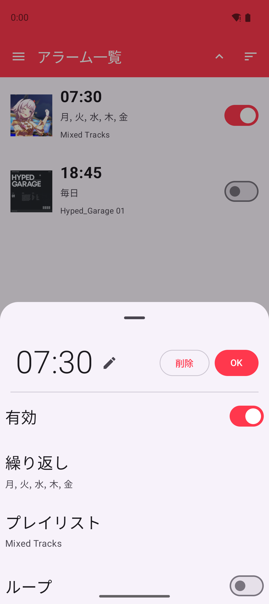
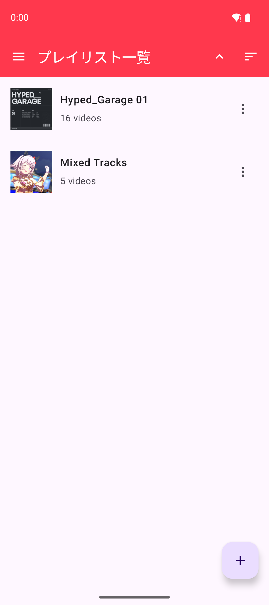
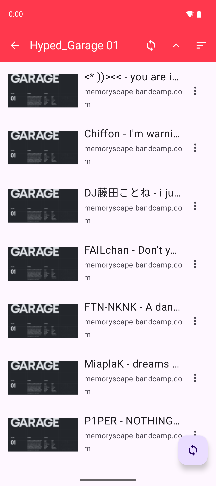
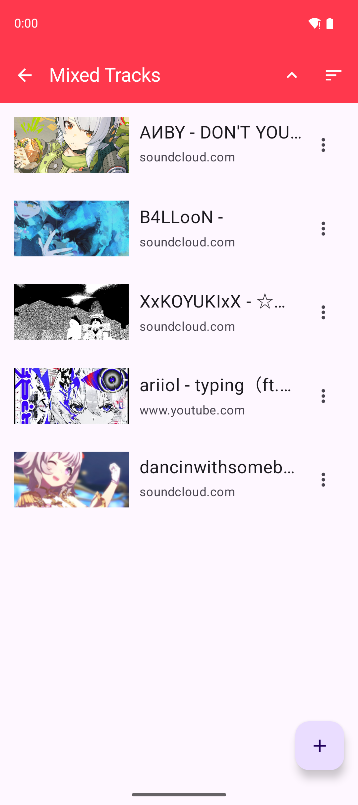
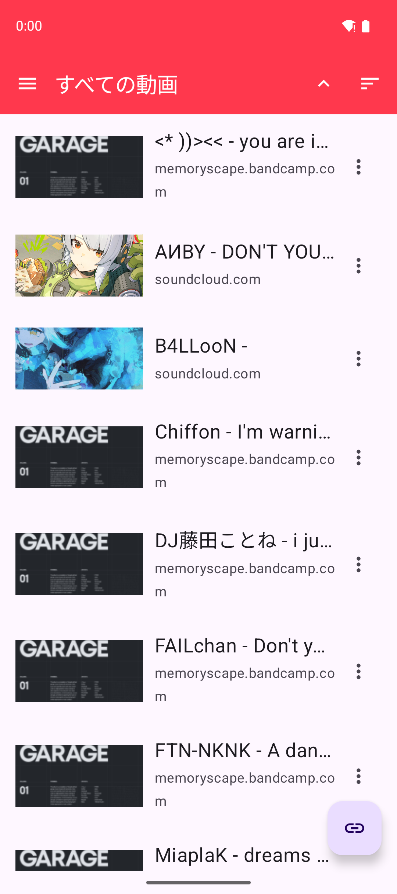
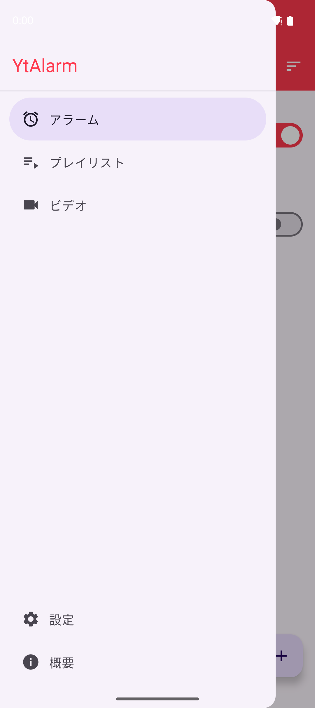
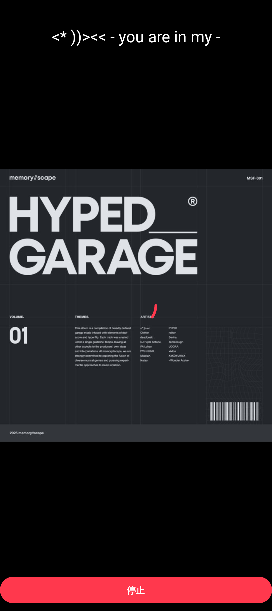
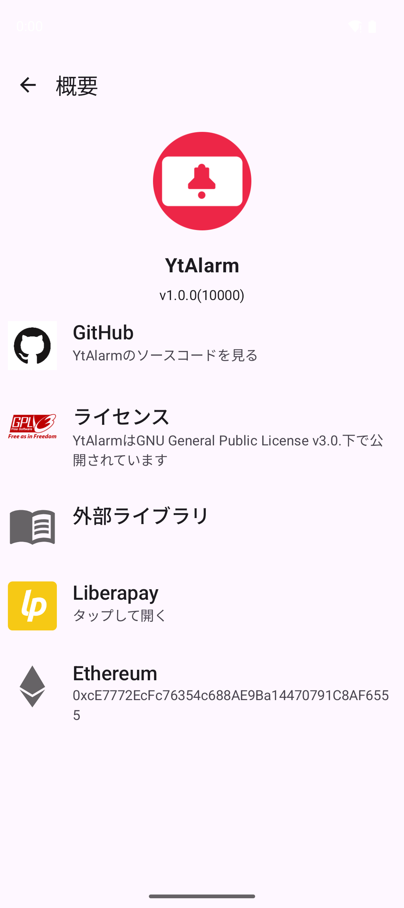

# YtAlarm

[Back to English one](../../README.md)

**注意：このアプリおよびそのフォークをGooglePlayStoreに掲載しないでください。これはGoogleの利用規約に反します。**

YtAlarmは[youtubedl-android](https://github.com/yausername/youtubedl-android)を使用したシンプルな目覚ましアプリです。好きな動画や音楽で目覚めることができます。  
本アプリはGoogleの開発者向けサービス及びYoutubeAPI等のサービス依存のAPIを使用していないため、サポートされているApiレベルを満たしたAndroidデバイスであれば全て問題無く動作します(たぶん)  
またこのアプリを使用するために各サービスのアカウントは必要ありません  

# スクリーンショット

# 機能

### アラーム

- リピート(毎日、曜日指定、日付け指定)
- ループ
- 音量指定
- スヌーズ

### プレイヤー

- ストリーミング
- ~~ダウンロード~~(準備中 [#140](https://github.com/turtton/YtAlarm/issues/140))

### メディア管理

- プレイリストのインポート

# 対応サービス

内部的には[yt-dlp](https://github.com/yt-dlp/yt-dlp)を叩いてるだけなので[ここ](https://github.com/yt-dlp/yt-dlp/tree/master/yt_dlp/extractor)にあるサービスは動くと思いますが、一部サービスではダウンロードモードのみが動作する場合があります。

[確認済みリスト](../AVAILABLE_SERVICES.md)

# コントリビューション

バグ報告、機能の提案、翻訳、コード変更などなんでも大歓迎です

詳しくは[Contributing(日本語)](../contributing/CONTRIBUTING_ja.md)をご覧ください

# Donate

If you like YtAlarm, you're welcome to send a donation.

<table>
    <tr>
        <td></td>
        <td>

</td>
        <td></td>
    </tr>
    <tr>
        <td>

</td>
        <td>

</td>
        <td>3C3aj9pXf6xSm5im4ZMtmS3HeoGpBNtD7t  </td>
    </tr>
</table>

## License

YtAlarmは[GNU General Public License v3.0](https://github.com/turtton/YtAlarm/blob/HEAD/LICENSE)ライセンス下で公開されています

他の使用ライブラリとツールのライセンスについては以下より確認できます

